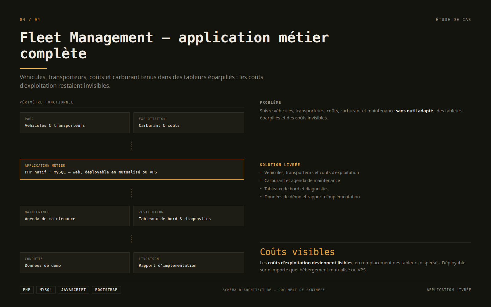

# Fleet Management — application métier PHP/MySQL complète

**Problème :** suivre véhicules, transporteurs, coûts, carburant et maintenance
sans outil adapté = tableurs éparpillés, coûts invisibles.

**Solution livrée :** application web complète de gestion de flotte.
- Véhicules, transporteurs, coûts d'exploitation, carburant, agenda maintenance
- Tableaux de bord, diagnostics, données de démo, rapports d'implémentation
- PHP natif + MySQL, déployable sur n'importe quel hébergement mutualisé ou VPS

**Stack :** PHP · MySQL · JavaScript · Bootstrap

> Code privé — démo sur demande / NDA.

**Une gestion métier sur mesure ?** ERP, modules Dolibarr, applications PHP.
**Mohamed Maache** — Tech Lead, 26 ans d'expérience · [Malt](https://www.malt.fr/profile/mohamedmaache3) · [LinkedIn](https://www.linkedin.com/in/mohamed-maache-538828239/)

## Schéma du périmètre fonctionnel

*Schéma de synthèse — document d'architecture, pas une capture d'écran de l'interface.*
